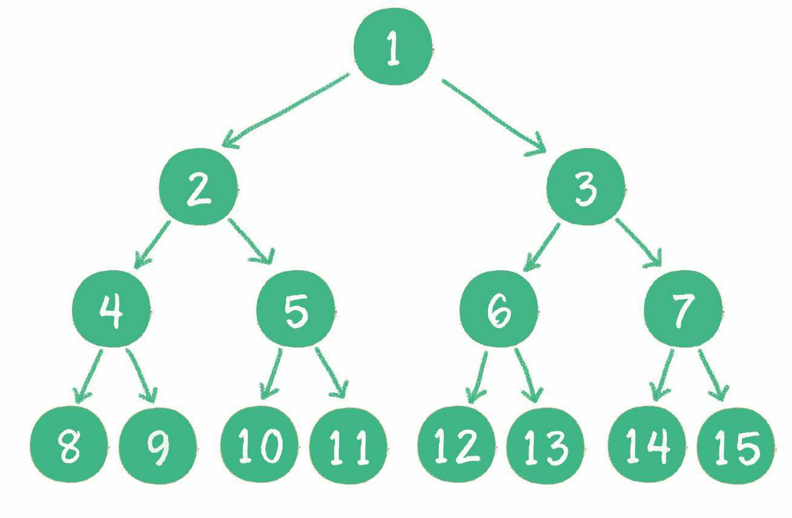

## 数学相关
(1)分组
$$ y=\left\{
\begin{aligned}
&1\\
&2+x
\end{aligned}
\right.$$

(2)

## 文字字体相关
(1)使用标签 font 的属性 red 规定标签内文字颜色
```html
<font color=red>文字</font>
```
<font color=red>文字</font>

font标签不仅可以改变颜色，还包括size 

使用latex则会改变字体大小
```markdown
颜色$\color{Tomato}{颜色}$
```
颜色$\color{Tomato}{颜色}$

(2)高亮
```markdown
==文字color=red==
```
==文字==

## 段落格式
```markdown
&emsp; 表示首行缩进一个全角字符
&ensp; 表示首行缩进一个半角字符
```

## 图片相关
####（1）插入图片
可以修改图片大小和位置
```markdown
<div align=left>

</div>
```

```markdown

```


## 绘图
### 流程图语法 mermaid

```text
mermaid提供流程图、时序图等多种绘图语法

绘制流程图
flowchart TB
node1[desc]-->node[desc]

绘制时序图
sequenceDiagram
线条类型： 
-> 实线 --> 虚线 ->> 实线箭头 -->> 虚线箭头 
-x 带x的实线箭头 --x 带x的虚线箭头


　
```


