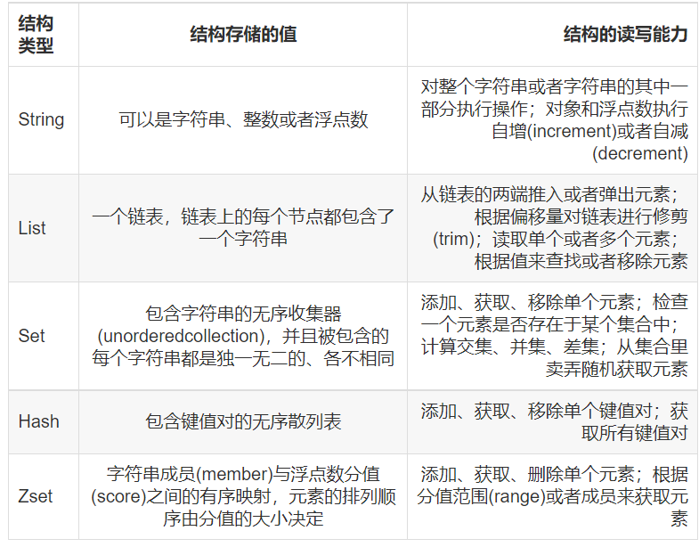
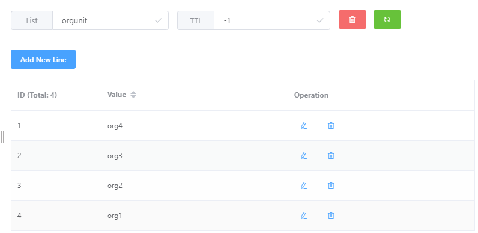

# Redis数据类型和基本操作

<div align=left>

</div>

---


设置key的过期时间为seconds(秒)
expire key seconds;

设置key的过期时间为millSeconds(毫秒)
pexpire key millSeconds;
## String字符串
常用于token、session缓存，uid为key，value为对应的值
```text{.line-numbers}
新增一个键值对
set key value;

新增一个键值对，并设置过期时间为seconds(秒)
setex key seconds value;

新增一个键值对，并设置过期时间为millSeconds(毫秒)
psetex key millSeconds value;

获取key对应的value
get key;

将key对应的value设置为newValue,并返回oldValue
getset key newValue;

删除键值对
del key;
```
---
## List列表
list结构为一个key对应多个value，类似于一个key为一个LinkList对象。其内部元素按插入顺序排序，可以向头部或尾部添加数据，一个key的list可存储 2^32^ - 1个元素。常应用于消息队列
<div align=left>

</div>

```text{.line-numbers}
向key对应的列表头部插入多个元素，如果key不存在则创建list
lpush key value1[value2...];

向已存在的key对应的列表头部插入多个元素
lpushx key value1[value2...];

获取并移除列表头部元素，返回值为key value
lpop key;

获取并移除列表尾部元素,返回值为key value
rpop key;

获取并移除列表头部元素，如果列表为空则命令阻塞，直到列表中有元素可以获取，或者命令超时(秒),返回值为key value
blpop key timeOutSeconds;

获取key对应的列表长度
llen key;

获取列表中指定位置的元素，index从0开始
lindex key index;

获取key对应的列表指定范围内的元素
lrange key startIdx endIdx;
```

## Hash

```text
将多个键值对映射到一个key
hset key field1 value1 [field2 value2 ...]

获取hash表中指定字段的值
hget key field
```

## Set
sring类型的无序集合，其中元素不重复

```text{.line-numbers}
向key对应的set中添加一个或多个成员
sadd key member1 [member2 ...]

获取set中成员数量
scard key

获取set中所有成员
smembers key

移除set中一个或多个成员
srem key member1 [member2 ...]
```

## Zset
// TODO:未完成
有序集合，每个元素关联一个排序字段score，根据score进行排序。

```text
添加一个或多个成员
zadd key score1 member1 [score2 member2 ...]


```

// TODO: redis持久化策略