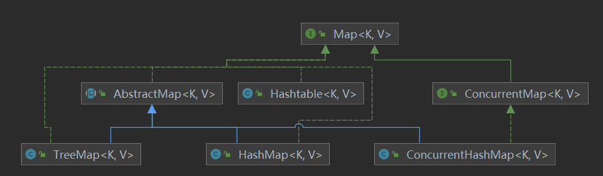
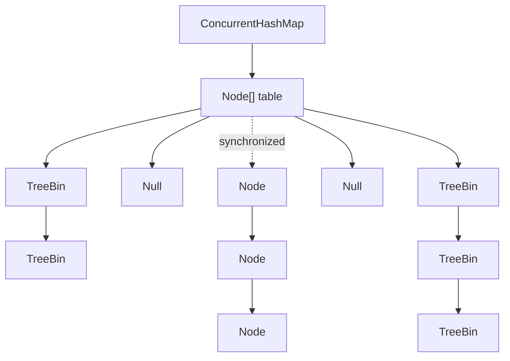

# Map及其子类

<div align=left>

</div>

```plantuml
Interface Map<K,V>{
    Interface Entry<K,V>
}

Interface ConcurrentMap<K,V> extends Map

abstract class AbstractMap<K, V> implements Map{
    {static} class SimpleEntry<K,V>
}

class HashMap<K,V> extends AbstractMap implements Map{
    {static} class Node<K,V>;
    {static} final class TreeNode<K,V>;
    transient Node<K,V>[] table;
    transient Set<Map.Entry<K,V>> entrySet;
    {static} final int DEFAULT_INITIAL_CAPACITY = 1 << 4;
    {static} final float DEFAULT_LOAD_FACTOR = 0.75f;
    int threshold;
    int loadFactor;
    transient int modCount;

}
note left of HashMap::table
    数组的索引i对应hash(key)的结果
end note
note left of HashMap::threshold
    table数组的扩容阈值
end note
note left of HashMap::loadFactor
    扩容时计算新数组大小用到的系数
end note
note left of HashMap::modCount
      HashMap对象的操作次数，
    这里操作定义为修改key-value键值对的数量，
    或者修改table数组结构
      该属性的目的是在并发情况下，
    如果hashMap对象被其它线程修改，则将迭代失败
end note

class LinkedHashMap<K,V> extends HashMap {
    {static} class Entry<K,V>
}

abstract class Dictionary<K,V>

class HashTable<K,V> extends Dictionary implements Map


Interface Entry<K,V>
class Node<K,V> implements Entry
class LinkedHashMap.Entry<K,V> extends Node {
    Entry before;
    Entry after;
}
class SimpleEntry<K,V> implements Entry

```

Map为AbstractMap、HashTable和ConcurrentMap的父类。Map中定义了Entry<K,V>作为key-value的存储结构，AbstractMap中通过定义静态类对Entry接口进行了简单实现，提供了set和get方法，并重写了equals和hashcode方法，只封装了keySet和values，并没有规定Entry的存储方式。

## HashMap

内部类Node实现了Entry，以数组+链表+红黑树的方式存储键值对

```java{.line-numbers}
/**
* put键值对之前会对key进行一次hash运算，调用到key.hashCode方法，
如果需要控制key的比较方式，需要重写其hashCode和equals方法
*/
public V put(K key, V value) {
    return putAll(hash(key), value, false, true);
}
/**
* (h = key.hashCode()) ^ (h >>> 16) 的结果并不是table数组中的索引，jdk8以后的
处理是，将hash值与table数组最大索引进行按位与运算，这样得到的结果就不会越界
*/
static final int hash(Object key) {
    int h;
    return (key == null) ? 0 : (h = key.hashCode()) ^ (h >>> 16);
}

/**
* 放入元素的方法，线程不安全
*/
final V putVal(int hash, K key, V value, boolean onlyIfAbsent,
                   boolean evict) {
        Node<K,V>[] tab; Node<K,V> p; int n, i;
        // 如果table数组未初始化，或者长度为0，则通过resize方法初始化，默认容量为16，扩容阈值为8
        if ((tab = table) == null || (n = tab.length) == 0)
            n = (tab = resize()).length;
        // n为table数组长度，(n-1)&hash为根据hash计算其在数组中位置的方式
        // 如果 key 对应的位置没有元素，则在该位置放上新的Node对象key,value
        if ((p = tab[i = (n - 1) & hash]) == null)
            tab[i] = newNode(hash, key, value, null);
        // 如果 key 对应的位置上已经有元素 p
        else {
            Node<K,V> e; K k;
            /** 如果 p 的hash值与key相同，且p.key与key相同(这里体现了key对象的equals方法)，
            则指针 e 指向 p 所代表的Node对象
            */
            if (p.hash == hash &&
                ((k = p.key) == key || (key != null && key.equals(k))))
                e = p;
            // 如果key的hash值与p的hash值不同，说明出现hash冲突
            // p位置是否是TreeNode
            else if (p instanceof TreeNode)
                // 如果已经树化，则调用putTreeVal方法
                e = ((TreeNode<K,V>)p).putTreeVal(this, tab, hash, key, value);
            // 如果没有树化，则以链表的形式对存储冲突的Node对象
            else {
                for (int binCount = 0; ; ++binCount) {
                    // 对p的后继元素进行遍历
                    //如果到达链表最后一个元素，则说明需要新增Node对象
                    if ((e = p.next) == null) {
                        p.next = newNode(hash, key, value, null);
                        // 如果此时链表长度已经大于树化的阈值，则对链表进行树化
                        if (binCount >= TREEIFY_THRESHOLD - 1) // -1 for 1st
                            treeifyBin(tab, hash);
                        break;
                    }
                    //如果此时的结点e的hash值和key都与目标值，e为需要被更新的结点
                    if (e.hash == hash &&
                        ((k = e.key) == key || (key != null && key.equals(k))))
                        break;
                    p = e;
                }
            }
            // 经过前面的检索，e已经指向正确的位置
            if (e != null) { // existing mapping for key
                V oldValue = e.value;
                if (!onlyIfAbsent || oldValue == null)
                    e.value = value;
                /** 这里是为LinkedHashMap定义的方法，HashMap中为空方法
                * LinkedHashMap中在访问数组table中的Node对象后，会将其移动到数组的最后面
                */
                afterNodeAccess(e);
                return oldValue;
            }
        }
        //操作次数加1
        ++modCount;
        // size加1，如果此时超过了扩容阈值，则进行扩容
        if (++size > threshold)
            resize();
        /** 提供给LinkedHashMap的方法, 在插入Node后，如果evict为true，则删除头结点
        */
        afterNodeInsertion(evict);
        return null;
    }

```

## HashTable

key-value以Entry数组的形式存储，数组中各元素之间以单向链表的形式串联，采用synchronized锁整个HashTable对象的方式实线线程安全的put、remove、forEach操作。
注意，如果使用for(Entry e : hashTable)的方式遍历，其它线程进行insert等操作时，会抛出ConcurrentModificationException异常

```java{.line-numbers}
public synchronized V put(K key, V value) {
        // Make sure the value is not null
        if (value == null) {
            throw new NullPointerException();
        }

        // Makes sure the key is not already in the hashtable.
        // 获取当前Entry数组
        Entry<?,?> tab[] = table;
        // 根据key的hashCode方法获取hash值，因此K类需要重写hashCode方法
        int hash = key.hashCode();
        // 0x7FFFFFFF 是0111 1111 1111 1111 1111 1111 1111 1111，将符号位设为0，进行运算后得到的都是正整数
        int index = (hash & 0x7FFFFFFF) % tab.length;
        @SuppressWarnings("unchecked")
        // 获取目标索引处的entry
        Entry<K,V> entry = (Entry<K,V>)tab[index];
        // 如果遍历目标索引处的链表，如果没有找到同一个key，说明需要向数组中添加新的Entry
        for(; entry != null ; entry = entry.next) {
            if ((entry.hash == hash) && entry.key.equals(key)) {
                V old = entry.value;
                entry.value = value;
                return old;
            }
        }

        addEntry(hash, key, value, index);
        return null;
    }


private void addEntry(int hash, K key, V value, int index) {
        modCount++;

        Entry<?,?> tab[] = table;
        if (count >= threshold) {
            // Rehash the table if the threshold is exceeded
            rehash();

            tab = table;
            hash = key.hashCode();
            index = (hash & 0x7FFFFFFF) % tab.length;
        }

        // Creates the new entry.
        @SuppressWarnings("unchecked")
        Entry<K,V> e = (Entry<K,V>) tab[index];
        tab[index] = new Entry<>(hash, key, value, e);
        count++;
    }


```

## ConcurrentHashMap
利用cas+synchronized锁数组中Node的方式实线线程安全，相较于HashTable，降低了锁的粒度



```java{.line-numbers}
final V putVal(K key, V value, boolean onlyIfAbsent) {
        if (key == null || value == null) throw new NullPointerException();
        int hash = spread(key.hashCode());
        int binCount = 0;
        for (Node<K,V>[] tab = table;;) {
            Node<K,V> f; int n, i, fh;
            // 如果table数组为空,说明尚未初始化，则进行初始化
            if (tab == null || (n = tab.length) == 0)
                tab = initTable();
            // 如果f为null,说明key对应的位置尚未被占用,使用unsafe.compareAndSwapObject方法插入新的Node结点
            else if ((f = tabAt(tab, i = (n - 1) & hash)) == null) {
                if (casTabAt(tab, i, null,
                             new Node<K,V>(hash, key, value, null)))
                    break;                   // no lock when adding to empty bin
            }
            // 如果key所在位置的结点hash值为MOVED=-1, 说明此时有其它线程正在进行扩容操作，则将f放入正在扩容的线程中一起扩容
            else if ((fh = f.hash) == MOVED)
                tab = helpTransfer(tab, f);
            else {
                // 如果没有其它线程正在操作 此时的f，则用synchronized锁住
                V oldVal = null;
                synchronized (f) {
                    // 再次确认处于数组i位置的Node没有被修改。因为table数组被volatile修饰的，可以确保线程间的可见性
                    if (tabAt(tab, i) == f) {
                        if (fh >= 0) {
                            // 用于记录结点数，超过阈值后转为红黑树
                            binCount = 1;
                            for (Node<K,V> e = f;; ++binCount) {
                                K ek;
                                if (e.hash == hash &&
                                    ((ek = e.key) == key ||
                                     (ek != null && key.equals(ek)))) {
                                    oldVal = e.val;
                                    if (!onlyIfAbsent)
                                        e.val = value;
                                    break;
                                }
                                Node<K,V> pred = e;
                                if ((e = e.next) == null) {
                                    pred.next = new Node<K,V>(hash, key,
                                                              value, null);
                                    break;
                                }
                            }
                        }
                        // 如果 fh < 0，说明此处为红黑树，
                        else if (f instanceof TreeBin) {
                            Node<K,V> p;
                            binCount = 2;
                            if ((p = ((TreeBin<K,V>)f).putTreeVal(hash, key,
                                                           value)) != null) {
                                oldVal = p.val;
                                if (!onlyIfAbsent)
                                    p.val = value;
                            }
                        }
                    }
                }
                // 如果增加完Node后，链表长度超过8，则进行树化
                if (binCount != 0) {
                    if (binCount >= TREEIFY_THRESHOLD)
                        treeifyBin(tab, i);
                    if (oldVal != null)
                        return oldVal;
                    break;
                }
            }
        }
        addCount(1L, binCount);
        return null;
    }

```