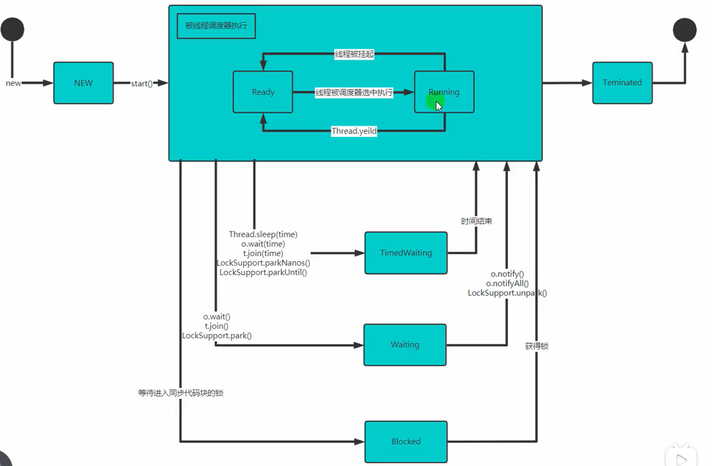

# 一、线程创建与生命周期
## 进程和线程

进程是各个应用程序在内存中占用的空间，各进程之间互不干扰。同时，CPU为每个程序分配一个时间段，称之为进程的时间片。如果时间片结束进程还没有运行完，则暂停该进程，并将CPU分配给其它进程<font color=tomato>（上下文切换）</font>。被暂停的进程会保存当前的状态（进程标识、进程使用的资源等），下次切换回来时可保持暂停前的状态继续运行。如果在时间片内进程运行阻塞或结束，则CPU不用等待时间片结束，立即切换到其它进程。

CPU时间片保证了操作系统在同一时间内运行多个进程，而线程使进程在同一时间内可执行多个子任务

<font color=tomato size=4>进程和线程的本质区别</font>：是否单独占有内存地址空间和其他系统资源（例如I/O）。
（1）进程之间存在内存隔离，因此一个进程出现问题不会影响到其他进程和操作系统的稳定，<font color=red>各个进程间数据同步简单但数据共享复杂 why?</font>，进程的创建和销毁需要保存寄存器和栈信息、资源的分配回收和分页调度；线程可以共享进程的内存和资源

<font color=tomato size=4>上下文切换</font>：指CPU从一个进程或线程切换至另一个进程或线程。<font color=tomato>上下文</font>指某一时刻CPU的寄存器和程序计数器的内容。
<font color=tomato>寄存器</font>通过对常用值（通常是运算的中间值）的快速访问来提高计算机程序运行的速度，<font color=tomato>程序计数器</font>是CPU中专用的寄存器，用来记录指令集序列中CPU正在执行的位置，存储的内容为正在执行的指令的位置或下一个将要执行的指令的位置<font color=red>（如何理解“指令的位置”？）</font>

<font color=tomato size=4>上下文切换过程</font>：内核<font color=red>（如何理解操作系统内核？）</font>在CPU上对进程（包括线程）进行以下活动：

（1）挂起一个进程，并将其上下文存储在内存中；
（2）在内存中检索下一个进程的上下文，并将其在寄存器中恢复；
（3）将CPU跳转到程序计数器所指向的位置，及进程被中断时的代码行，恢复该进程


---
## 1、Thread类和Runnable接口
<div align=left>

</div>
使用runnable借口的方式创建线程，耦合性更低

```java{.line-numbers}
public Class Main {
    public void main(String[] args) {
         /**
         * 线程构造方法中都会调用init方法，为Thread私有属性赋值，线程名默认为Thread-0，从0开始
         * public Thread() {
         *         init(null, null, "Thread-" + nextThreadNum(), 0);
         *     }
         *
         * 创建后默认所属的组为父线程的组，但并不会将线程加入到组中，而是在调用start方法后才会将线程加入组中
         * private void init(ThreadGroup g, Runnable target, String name,
         *                       long stackSize) {
         *         init(g, target, name, stackSize, null, true);
         *     }
         */

        /** 使用有参构造，为线程注入Runnable对象 Thread(Runnable target)*/
        Thread t2 = new Thread(()->System.out.println("run"), "T2");
        t2.start();//执行过main，如果这里调用run方法，则在main线程中执行并使main线程阻塞
        System.out.println(t2.getThreadGroup());
        // 输出为 java.lang.ThreadGroup[name=main,maxpri=10]
        /**
         * 传入Runnable后才会在start()时执行调用本地方法start0()取执行run方法
         * private native void start0();
         *
         * @Override
         * public void run () {
         *    if (target != null) {
         *      target.run();
         *      }
         *    }
         * 因此，Runnable的内容是线程执行的业务逻辑
         */
        ThreadGroup threadGroup = Thread.currentThread().getThreadGroup();
        Thread[] threads = new Thread[threadGroup.activeCount()];

        Thread.enumerate(threads);
        Arrays.asList(threads).forEach(o ->System.out.println(o));//输出为 Thread[main,5,main] Thread[Monitor Ctrl-Break,5,main]
    }
}
```
```java{.line-numbers}
public class Thread implements Runnable{
    /**
    (1)线程对象 Thread t1 = new Thread() 被创建后，首先进入的是'NEW'状态，
对应的threadStatus=0，因此执行start()方法时，会先判断线程是否为NEW状态;
    (2)状态判断通过后，将t2加入其所在的线程组，如果创建时没指定，则与父线程同在一个线程组。
    (3)指定start0()方法，该方法内将调用t2$target#run()方法
    */
    public synchronized void start() {
        /**
         * This method is not invoked for the main method thread or "system"
         * group threads created/set up by the VM. Any new functionality added
         * to this method in the future may have to also be added to the VM.
         *
         * A zero status value corresponds to state "NEW".
         */
        if (threadStatus != 0)
            throw new IllegalThreadStateException();

        /* Notify the group that this thread is about to be started
         * so that it can be added to the group's list of threads
         * and the group's unstarted count can be decremented. */
        group.add(this);

        boolean started = false;
        try {
            start0();
            started = true;
        } finally {
            try {
                if (!started) {
                    group.threadStartFailed(this);
                }
            } catch (Throwable ignore) {
                /* do nothing. If start0 threw a Throwable then
                  it will be passed up the call stack */
            }
        }
    }

    private native void start0();
}
```

---
## 2、线程状态
<div align=left>

</div>
线程的其中状态：NEW、BLOCKED、READY、RUNNING、WAITING、TIMEWAITING、TERMINATED

## 3、线程方法

### 2.1 使线程由RUNNING进入WAITING状态
Object.wait()、Thread.sleep、LockSupport.park()

# 二、线程安全
## Java中锁的分类
## synchronized实现

### Reference

[1] 《深入浅出Java多线程》
[2] 