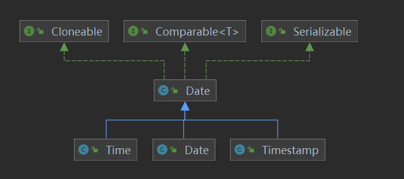

# Java中对时间的处理方式
Java中java.util.Date类包含三个子类java.sql.Time、java.sql.Date和java.sql.TimeStamp

<table>
<tr>
<td>java.util.Date</td><td>年，月，日，时，分，秒</td>
</tr>
<tr>
<td>java.sql.Date</td><td>年，月，日</td>
</tr>
<tr>
<td>java.sql.Time</td><td>时，分，秒</td>
</tr>
<tr>
<td>java.sql.TimeStamp</td><td>年，月，日，时，分，秒，纳秒</td>
</tr>
</table>