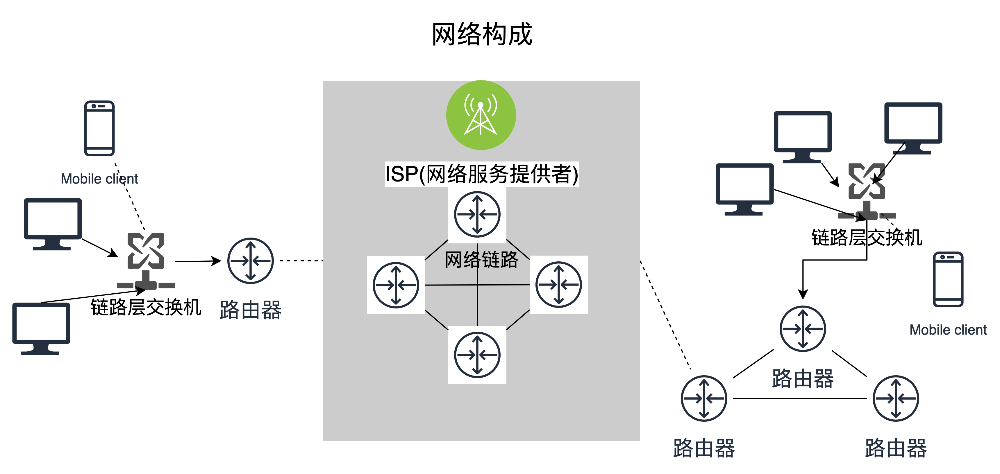
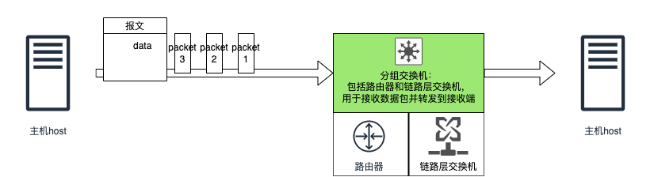
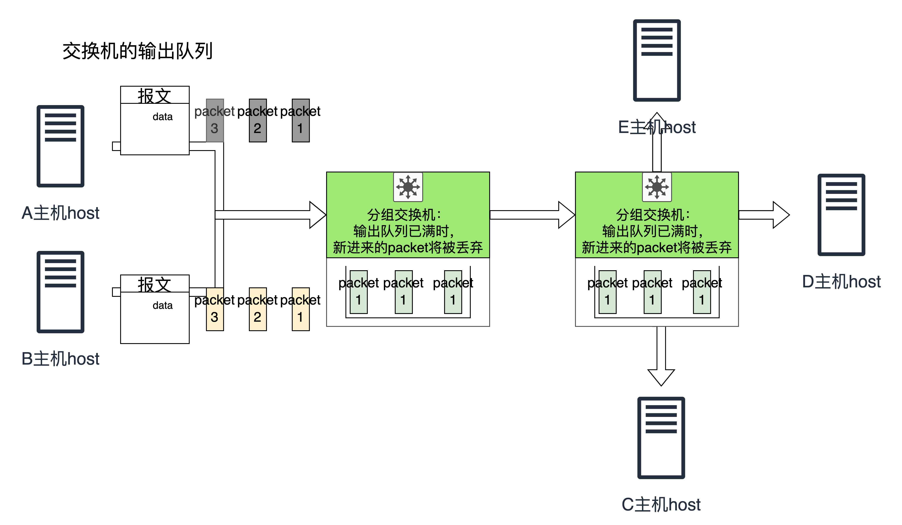
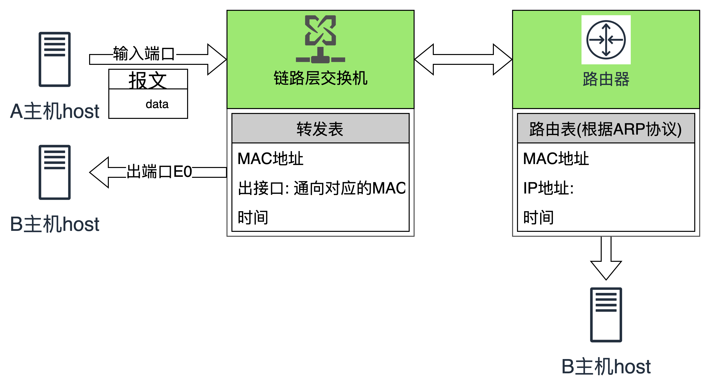

[TOC]

## chapter 1. 计算机网络和英特网

### 1.2 网络构成
主机和主机通过交换机相连，共享一个广播域。接入运营商(电信、移动、联通等)提供的网络后，连接到运营商网络链路中，从而与其他主机构成连接。

网络构成示意图(简)

### 1.3 网络的核心：数据包通过分组交换机和链路在主机之间传递

 

#### 1.3.1 数据包的交换
主机将数据组装成报文，传输给制定的交换机。通常一个报文会被分为多个packet进行传输，交换机等一个报文的所有packet接收完成后，传递给目标主机(转发规则将在后面介绍)

主机之间数据包传输示意图(简易)

 

通常一个交换机是连接多台主机的，当一条链路因传输而阻塞时，已接收的packet会被换存在一个输出队列中(output queue)，当输出队列被填满时，新到达的packet将被丢弃，从而出现丢包现象

丢包现象(简易)

 
转发表和路由协议

因特网中，交换机和路由器之所以能够找到接收端主机，是因为它们内部维护了一张表，根据数据报文头部的信息，寻找出端。交换机内部的是转发表，根据机器MAC寻找出端线路进行转发；而路由器内部维护的是路由表，通过地址解析协议将IP地址转换为MAC(目的主机或路由器)地址，进行路由转发。

转发和路由

 

#### 1.3.2 电路交换

## IPv4地址
### 
32位,前24位表示网络,最后一位表示主机地址
A类网络: 前8位表示网络号, 后24位表示主机号
B类网络: 前16位表示网络号,后16位表示主机号
C类网络: 前24位表示网络号,后8位表示主机号
D类网络: 前四位固定为1110
E类网络: 前四位固定为1111

划分子网后, 