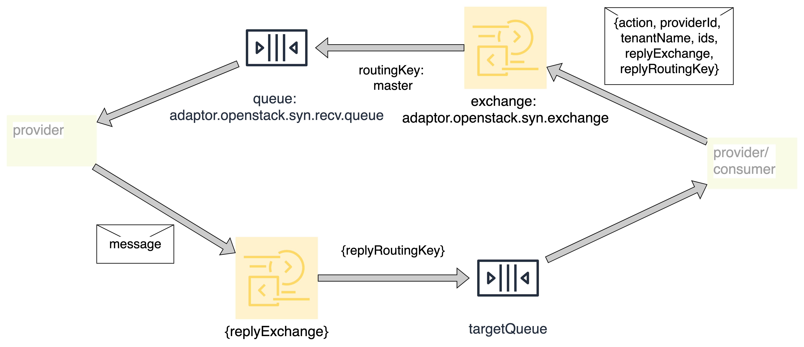

<div align=left>

<center>消息传递过程</center>
</div>
<br>

## Spring Cloud Stream3.2 新特性

### binders声明
binder相当于消息来源服务器的规定, rabbitmq-node1、rocketmq、Kafka都可以被声明为一个binder, 注册到springCloud Stream的binders中.

通过binder, 可以将不同消息源对接、 手动选择消息源的配置等

```yaml
spring: 
  cloud:
    stream:
      binders: # binders 为 Map<String, BinderProperties>, 其中key 为声明的名称“rabbit”, BinderProperties包括 type、 enviroment属性, 用于配制消息服务器, 其中type可以为rabbit、kafka、rocket, 取决于引入了哪些消息队列的依赖
        rabbit: 
          type: rabbit
          environment:
            spring:
              rabbitmq:
                dynamic: false
                host: localhost
                port: 5672
                username: luc
                password: luc123456
                virtual-host: v1
  
```
### 消息生产者: 函数式声明
### 消息生产者: 手动发送消息

### 消费者与队列监听
在spring cloud stream2.x版本, 需要使用@Stream Listener创建对指定消息队列的监听. 

生产者于exchange的绑定声明


### 消费失败
类型转换失败, queue中消息会丢失

StreamBirdge(consumer-in-0, data)

将路由键放在headers, BaseMsg继承Message(org.springframework.messaging.Message;)
重写 getPayload和getHeaders方法

使用function方式声明生产者和消费者时, 需要发送Message子类才能成功路由到指定队列
