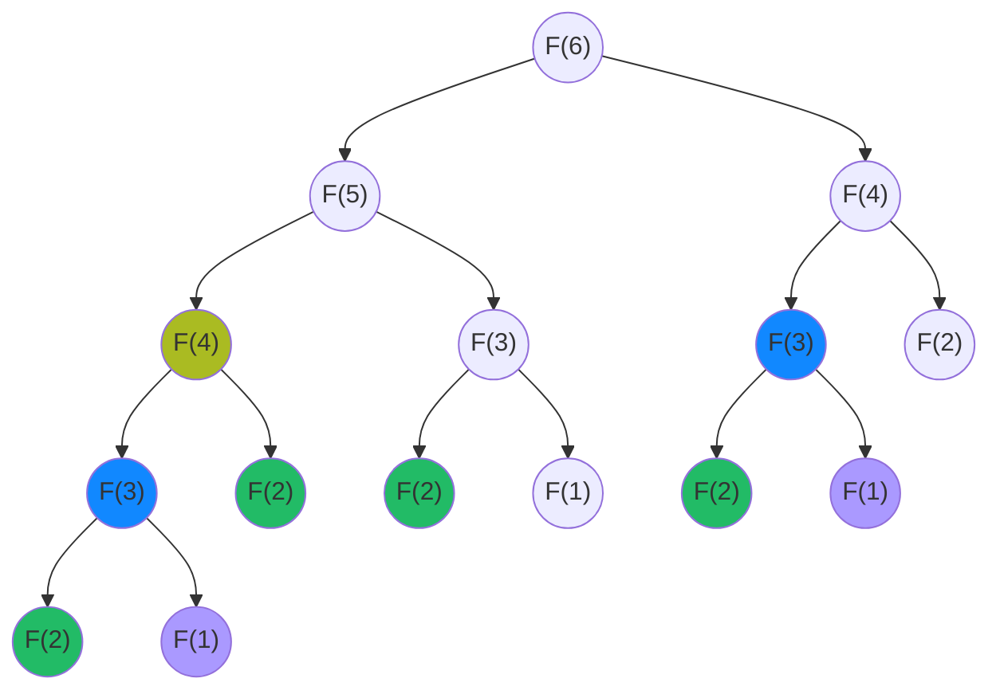
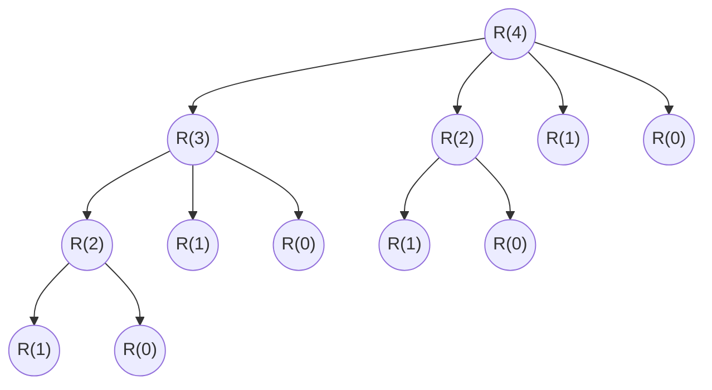

# 动态规划算法
前提条件：问题F(n)具有<font color=Tomato>最优子结构</font>且<font color=Tomato>子问题重叠</font>，例如求解
$$
F(n) = F(n-1) + F(n-2)
$$
&emsp;&emsp;问题可以被分为两个子问题，F(n-1)和F(n-2)称为F(n)的最优子结构, F(n)和其最优子结构之间的关系被称之为<font color=Tomato>状态转移方程</font>，F(1)和F(2)=1称之为边界条件。
如果用递归的方法进行求解，
```java{.line-numbers}
public static void main(String[] args) {
    int n = 6;
    int fn = func(n); //计算8次，开辟栈帧15个
    
}
private int step = 0;
public int func(int n) {
    if(n <= 2) {
        return 1;
    }
    // 记录计算次数
    step ++;
    return func(n-1) + func(n-2);
}

```
递归的执行树为：



第1次递归调用 F(6) = F(5) + F(4)，进入第三次调用时，开始出现了重复计算，每次重复计算意味着多开辟一个栈帧，所以无论时空间还是时间上，都存在浪费。

### 1、自顶向下+备忘录的递归算法
```java{.line-numbers}
public static void main(String[] args) {
    Map<Integer, Integer> map = new HashMap<>();
    int n = 6;
    int fn = treeTest.func(map,n); // 计算6次，开辟栈帧9个
}
public int func(Map<Integer,Integer> map, int n) {
    if(map.containsKey(n)) {
        return map.get(n);
    }
        // 记录计算次数
    step ++;
    if(n <=2) {
        map.put(n,1);
    } else {
        map.put(n, (func(map, n - 1) + func(map, n - 2)));
    }
    return map.get(n);
}
```
每次执行计算前先去查询是否已经计算过，没有则执行计算，并将结果放入缓存中。但是增加备忘录仍然是递归算法，在计算F(6)时还是需要开辟额外栈帧。

动态规划算法的核心是自底向上对F(n)进行求解。从最小的子问题开始，在对F(3)求解是只需要知道F(1)和F(2)即可，对F(4)求解是只需要知道F(2)和F(3)。因此确定子问题规模为2后，在每次求解完子问题将其数值保存在两个变量，供下一个子问题求解，可将空间复杂度降低为O(n)。

<table>
<tr>
<th></th><td>F(1)</td><td>F(2)</td><td>F(3)</td><td>F(4)</td><td>F(5)</td><td>F(6)</td>
</tr><tr><th></th>
<th bgcolor="#cc9999">1</th>
<th bgcolor="#cc9999">1</th>
<th bgcolor="#dd1222">2</th><th></th><th></th><th></th></tr></table>

<table>
<tr>
<th></th><td>F(1)</td><td>F(2)</td><td>F(3)</td><td>F(4)</td><td>F(5)</td><td>F(6)</td>
</tr>
<tr><th></th><th></th>
<th bgcolor="#cc9999">1</th>
<th bgcolor="#cc9999">2</th>
<th bgcolor="#dd1222">3</th><th></th><th></th></tr></table>

<table>
<tr>
<th></th><td>F(1)</td><td>F(2)</td><td>F(3)</td><td>F(4)</td><td>F(5)</td><td>F(6)</td>
</tr>
<tr><th></th><th></th><th></th><th bgcolor="#cc9999">2</th>
<th bgcolor="#cc9999">3</th>
<th bgcolor="#dd1222">5</th><th></th></tr></table>

根据以上对子问题的分析，
```java{.line-numbers}
public int funcDP(int n) {
    int a = 1;// n=1时的子问题结果
    int b = 1;// n=2时的子问题结果
    int fn = 2;//Fn
    for(int i = 3; i <= n; i ++) {
        fn = a + b;
        //更新子问题结果
        a = b;
        b = fn;
    }
    return fn;
}
```

提升难度：
一根长度为 i 的钢条的价格为 P~i~，给定钢条长度，求最大收益
<table>
<tr>
<td>长度 i</td><td>1</td><td>2</td><td>3</td><td>4</td><td>5</td><td>6</td><td>7</td><td>8</td><td>9</td>
</tr>
<tr>
<td>价格Pi</td><td>1</td><td>5</td><td>8</td><td>9</td><td>10</td><td>17</td><td>17</td><td>20</td><td>24</td>
</tr>
</table>

分析：
设长度为 i 的钢条，不切割时售价为P~i~，最优售价为R~i~；
|i|P~i~|R~i~|
|:--:|:--:|:--:|
|1|1|1|
|2|5|max{P~2~, R~1~ + R~1~ } -> <font color=Tomato>max{P~2~, P~1~ + R~1~ }</font>|
|3|8|max{P~3~, P~1~+R~2~, P~2~+R~1~} -> <font color=Tomato>固定长度为1，求解长度2的最优收益；固定长度为2，求解长度1的最优收益</font>|
|4|9|max{P~4~, P~1~+R~3~, P~2~+R~2~, P~3~+R~1~} -> <font color=Tomato>固定长度为1，求解长度3的最优收益；固定长度为2，求解长度2的最优收益；固定长度为3，求解长度1的最优收益</fong>|
|5|10|max{P~5~, R~1~+R~4~, R~2~+R~3~, R~3~+R~2~, R~4~+R~1~} -> <font color=Tomato>固定长度为1，求解长度4的最优收益；固定长度为2，求解长度3的最优收益；固定长度为3，求解长度2的最优收益；固定长度为1，求解长度4的最优收益</fong>|
|i|P~i~|max{P~i~, P~1~+R~i-1~, P~2~+R~i-2~,...,P~i-2~+R~2~, P~i-1~+R~1~}

对于长度为 n 的钢条，固定长度可以为：
1，则对长度n-1划分求最优收益；
2，则对长度n-2划分求最优收益;
...
i，则对长度n-i划分求最优收益；
n, 则对长度0求最优收益


用二叉树来理解更为形象：


因此<font color=Tomato>状态转移方程</font>可表示为
R~n~ = max(P~i~ + R~n-i~) (0<=i<=n)


综上，动态规划问题三个核心：
(1) 备忘录数组定义：int[] dp用于存放每一个i对应的最优收益
(2) dp[n]和其它元素的关系：dp[n] = max(p[i]+dp[n-i])
(3) 初始值dp[0] = 0

```java{.line-numbers}
public int DP(int[] p) {
    int[] dp = new int[p.length+1];
    int maxV = 0;

    for(int n = 1; n < p.length + 1; n ++) {
        // 实际上p[0]对应的是p1，例如p=[1,5,8,9,10]，们需要的是[0,1,5,8,9,10]            
        // 因此需要将循环从1开始，到p.length+1为止
        for(int i = 1; i <= n; i ++) {
            maxV = Math.max(maxV, p[i-1]+dp[n-i]);
        }
        dp[n] = maxV;
    }
    return dp[p.length];
}
```
**2022-5-13**
探究如何找最优子结构
- [ ] 最长上升子序列问题
- [ ] 二维数组寻址问题


