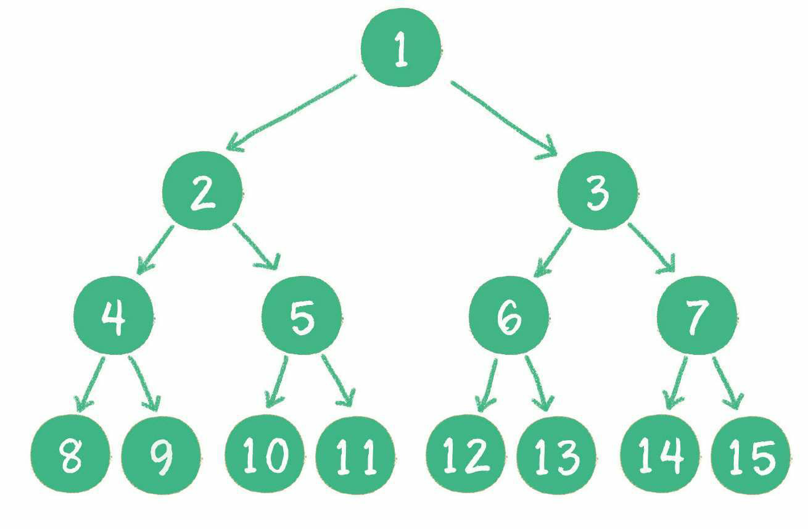

# 二叉树的遍历与搜索
---
## 一、树的基本概念
叶子结点：没有左右子结点的结点
树高 h：结点的最大层数
结点的度：结点拥有的子树的个数
树的度：各结点的度的最大值
树的高度 h 和节点总数 n 之间的关系： n <= 2^h^ - 1 

### 1.1 满二叉树
<div align=left>

</div>

结点个数与树的高度满足 n = 2^h - 1的树

### 1.2 完全二叉树
<div align=left> 

</div>

第 1 至 h-1 层为满二叉树，且第 h 层的结点都集中在左侧

---
## 二、树的存储方式
### 2.1 数组存储
<div align=left>

</div>
数组存储便于快速访问各个节点，但是如果有比较多的null结点，则会浪费存储空间。若数组长度为 n 则,

(1)最后一个非叶子结点的下标为 n/2 - 1
(2)下标为 i 的结点，其左子结点下标为 2 * i + 1，右子结点下标为2 * i + 2
(3)如果一个左子结点下标为 i ， 其父节点下标为(i-1)/2

### 2.2 链式存储
每个结点包含三部分：数据val、左子结点指针left和右子结点指针right
```java{.line-numbers}
public class BinaryNode<T>{
    public T val;
    public TreeNode<T> left, right;
} 
```

对于整个二叉树，只需要封装头结点，即可通过指针遍历到目标结点
```java
public class BinaryTree<T> {
    public BinaryNode<T> root;

    public BinaryTree(BinaryNode<T> root) {
        this.root = root;
    }

    public BinaryTree() {
        this.root = null;
    }
```


## 三、二叉树的遍历与构建
### 3.1 三种深度优先遍历方式
#### (1) 前序遍历

```java{.line-numbers}
    /**
     * 先序遍历二叉树，先访问当前节点，再向左递归，再向右递归, 递归终止条件为遇到null结点
     * @param p
     */
    public void preorder(BinaryNode<T> p) {
        if(p != null) {
            System.out.println(p.data.toString());
            preorder(p.left);
            preorder(p.right);
        }
    }
```
非递归实现方式：利用栈先进后出的特性，一边访问一边将结点入栈，当访问到null时，说明栈顶元素没有左子结点，需要将其弹出，并将指针指向其右结点
```java{.line-numbers}
public void preorderTraverse() {
        System.out.println("非递归前序遍历：");
        BinaryNode<T> p = this.root;
        Stack<BinaryNode<T>> stack = new Stack<>();
        while(p != null || !stack.isEmpty()) {
            if(p != null) {
                System.out.println(p.data.toString());
                stack.push(p);
                p = p.left;
            } else {
                System.out.println("^ ");
                p = stack.pop();
                p = p.right;
            }
        }
    }
```
#### (2) 中序遍历


#### (3) 后序遍历

### 3.2 层次遍历
利用队列的先进先出特性，访问到结点 p 时，将其左右子结点入队，此时将 p 指向队列的出队结点，继续上面的入队方式
```java{.line-numbers}
    public void levelOrder() {
        System.out.println("层序遍历：");
        Queue<BinaryNode<T>> queue = new LinkedList<>();
        BinaryNode<T> p = this.root;
        
        while(p != null) {
            // 访问 p 结点
            System.out.println(p.data.toString());
            if(p.left != null) {
                queue.add(p.left);
            }
            if(p.right != null) {
                queue.add(p.right);
            }
            // 将 p 指向出队结点
            p = queue.poll();
        }
    }
```
# 3、二叉排序树
对每个非叶子结点的值，大于其左子结点值，并小于其右子结点值
# 霍夫曼树
# 4、平衡二叉树


#### Reference

