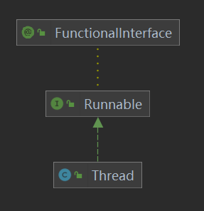
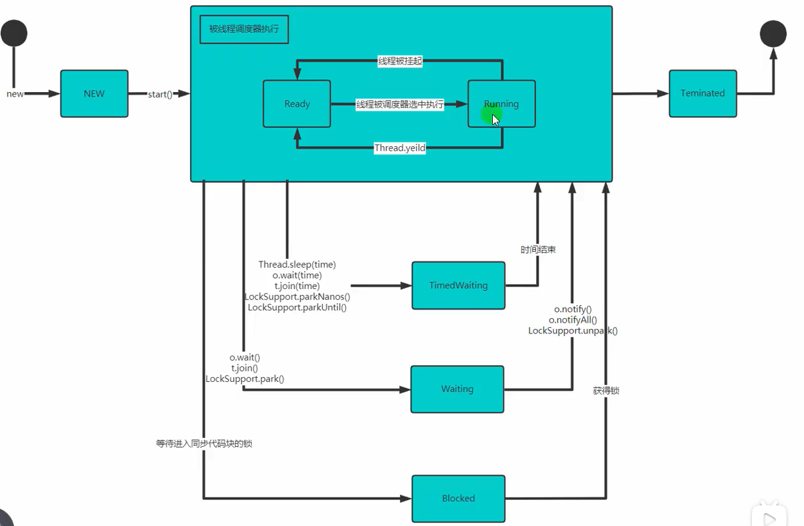

# 一、线程生创建与生命周期
## 进程和线程

进程是各个应用程序在内存中占用的空间，各进程之间互不干扰。同时，CPU为每个程序分配一个时间段，称之为进程的时间片。如果时间片结束进程还没有运行完，则暂停该进程，并将CPU分配给其它进程（上下文切换）。被暂停的进程会保存当前的状态（进程标识、进程使用的资源等），下次切换回来时可保持暂停前的状态继续运行。如果在时间片内进程运行阻塞或结束，则CPU不用等待时间片结束，立即切换到其它进程。
CPU时间片保证了操作系统在同一时间内运行多个进程，而线程使进程在同一时间内可执行多个子任务

---
## 1、Thread类和Runnable接口
<div align=left>

</div>


```java{.line-numbers}
public Class Main {
    public void main(String[] args) {
         /**
         * 线程构造方法中都会调用init方法，为Thread私有属性赋值，线程名默认为Thread-0，从0开始
         * public Thread() {
         *         init(null, null, "Thread-" + nextThreadNum(), 0);
         *     }
         *
         * 创建后默认所属的组为父线程的组，但并不会将线程加入到组中，而是在调用start方法后才会将线程加入组中
         * private void init(ThreadGroup g, Runnable target, String name,
         *                       long stackSize) {
         *         init(g, target, name, stackSize, null, true);
         *     }
         */

        /** 使用有参构造，为线程注入Runnable对象 Thread(Runnable target)*/
        Thread t2 = new Thread(()->System.out.println("run"), "T2");
        t2.start();//执行过main
        System.out.println(t2.getThreadGroup());
        // 输出为 java.lang.ThreadGroup[name=main,maxpri=10]
        /**
         * 传入Runnable后才会在start()时执行调用本地方法start0()取执行run方法
         * private native void start0();
         *
         * @Override
         * public void run () {
         *    if (target != null) {
         *      target.run();
         *      }
         *    }
         * 因此，Runnable的内容是线程执行的业务逻辑
         */
        ThreadGroup threadGroup = Thread.currentThread().getThreadGroup();
        Thread[] threads = new Thread[threadGroup.activeCount()];

        Thread.enumerate(threads);
        Arrays.asList(threads).forEach(o ->System.out.println(o));//输出为 Thread[main,5,main] Thread[Monitor Ctrl-Break,5,main]
    }
}
```
```java{.line-numbers}
public class Thread implements Runnable{
    /**
    (1)线程对象 Thread t1 = new Thread() 被创建后，首先进入的是'NEW'状态，
对应的threadStatus=0，因此执行start()方法时，会先判断线程是否为NEW状态;
    (2)状态判断通过后，将t2加入其所在的线程组，如果创建时没指定，则与父线程同在一个线程组。
    (3)指定start0()方法，该方法内将调用t2$target#run()方法
    */
    public synchronized void start() {
        /**
         * This method is not invoked for the main method thread or "system"
         * group threads created/set up by the VM. Any new functionality added
         * to this method in the future may have to also be added to the VM.
         *
         * A zero status value corresponds to state "NEW".
         */
        if (threadStatus != 0)
            throw new IllegalThreadStateException();

        /* Notify the group that this thread is about to be started
         * so that it can be added to the group's list of threads
         * and the group's unstarted count can be decremented. */
        group.add(this);

        boolean started = false;
        try {
            start0();
            started = true;
        } finally {
            try {
                if (!started) {
                    group.threadStartFailed(this);
                }
            } catch (Throwable ignore) {
                /* do nothing. If start0 threw a Throwable then
                  it will be passed up the call stack */
            }
        }
    }

    private native void start0();
}
```

---
## 2、线程状态
<div align=left>

</div>
线程的其中状态：NEW、BLOCKED、READY、RUNNING、WAITING、TIMEWAITING、TERMINATED

## 3、线程方法

### 2.1 使线程由RUNNING进入WAITING状态
Object.wait()、Thread.sleep、LockSupport.park()


### Reference

[1] 《深入浅出Java多线程》
[2] 